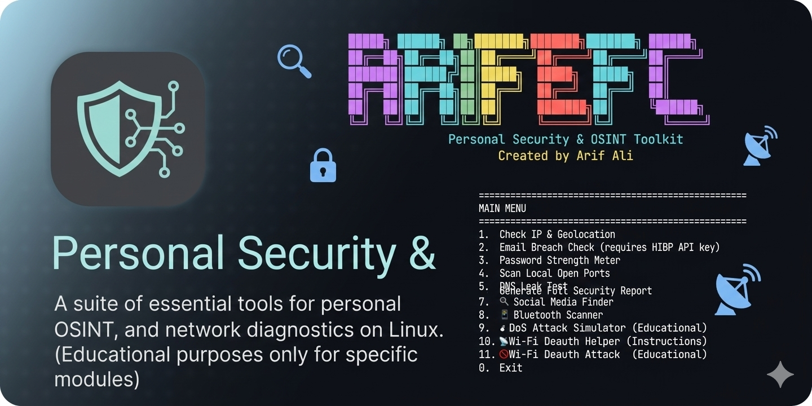
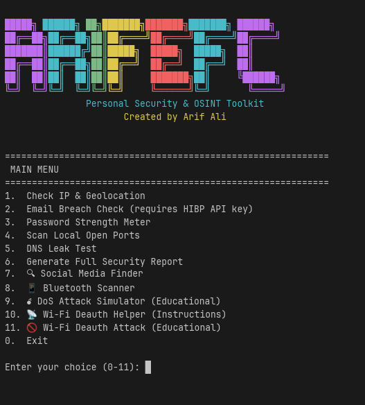

<p align="center">
  
</p>

<p align="center">
  
</p>

<p align="center">
  
  
  
  
  
  
</p>

<p align="center">
  <a href="#-features"></a>
  <a href="#-project-status"></a>
  <a href="#-installation"></a>
  <a href="#-usage"></a>
  <a href="#-development"></a>
  <a href="#-contributing"></a>
</p>

---

```text
```
█████╗ ██████╗ ██╗███████╗███████╗███████╗ ██████╗ 
██╔══██╗██╔══██╗██║██╔════╝██╔════╝██╔════╝██╔════╝ 
███████║██████╔╝██║█████╗  █████╗  █████╗  ██║      
██╔══██║██╔══██╗██║██╔══╝  ██╔══╝  ██╔══╝  ██║      
██║  ██║██║  ██║██║██║     ███████╗██║     ╚██████╗ 
╚═╝  ╚═╝╚═╝  ╚═╝╚═╝╚═╝     ╚══════╝╚═╝      ╚═════╝ 
      Personal Security & OSINT Toolkit
               Created by Arif Ali
[!WARNING]
⚠️ Ethical Use Only – This tool is designed for educational purposes and security testing on your own devices or networks with explicit permission. Unauthorised scanning, deauthentication attacks, or denial‑of‑service attempts are illegal. The developer assumes no liability for misuse.

✨ Features
Category	Features
🌐 Network Info	Public IP geolocation (city, region, country, ISP), DNS leak test, local open port scanner
🔐 Privacy Checks	Email breach lookup via Have I Been Pwned (requires free API key), password strength meter
🔍 OSINT	Social media username search across 700+ platforms (Instagram, LinkedIn, Facebook, TikTok, Twitter, Skype, Snapchat, Google, Microsoft prioritised), email‑to‑profile lookup
📱 Device Auditing	Bluetooth device scanner (nearby devices)
💣 Educational Attacks	DoS attack simulator (TCP SYN flood, limited to 100 packets), Wi‑Fi deauth attack tool (requires monitor mode and aircrack-ng)
📋 Reporting	Generate a full security report with all findings (saved as .txt)
📊 Project Status
<p align="center">      </p>
✅ Implemented Features
IP Geolocation – Shows public IP, city, region, country, ISP (via ip-api.com)

Email Breach Check – Integrates with Have I Been Pwned API (free key required)

Password Strength Meter – Analyzes password complexity with real‑time feedback

Local Open Port Scanner – Scans common ports on your machine

DNS Leak Test – Detects if your DNS queries are leaking to ISP

Social Media Finder – Searches 700+ platforms by username/email (prioritises major networks)

Bluetooth Scanner – Discovers nearby Bluetooth devices (requires bluez)

DoS Attack Simulator – Educational TCP SYN flood (limited to 100 packets)

Wi‑Fi Deauth Helper – Step‑by‑step instructions for deauth attacks

Wi‑Fi Deauth Attack Tool – Interactive tool to perform deauth on your own network

Security Report Generator – Exports all findings to a timestamped text file

🚧 In Progress / Planned
GUI / Web Interface – A simple web dashboard for easier interaction

Mobile Support – Test and optimise for Termux on Android

Vulnerability Scanner – Check local network for common misconfigurations

More OSINT Integrations – Add phone number lookup, domain reconnaissance

VPN Detection – Identify if you're behind a VPN/proxy

Automated Dependency Management – Improved cross‑platform install scripts

Docker Support – Containerised deployment for easy setup

📈 Contribution Opportunities
We're actively looking for contributors! Check out the Issues tab for tasks labeled help wanted or good first issue. Whether you're a developer, designer, or tester, your help is welcome.

📦 Installation
🔧 Prerequisites
Linux (Ubuntu/Debian recommended) or macOS

Python 3.8+

pip and git

🚀 Quick Install
bash
# 1. Clone the repository
git clone https://github.com/yourusername/ArifSec-Pro.git
cd ArifSec-Pro

# 2. (Recommended) Create and activate a virtual environment
python3 -m venv venv
source venv/bin/activate

# 3. Install required Python packages
pip install requests colorama
# Optional for social media finder:
pip install axiron

# 4. Install system dependencies (for advanced features)
sudo apt update
sudo apt install bluez hping3 aircrack-ng   # Debian/Ubuntu
# On macOS: brew install bluez hping3 aircrack-ng (if available)

# 5. Run the tool
python3 arifsec.py
[!TIP]
The tool will automatically prompt you to install any missing dependencies on first run. You can simply answer y to let it handle everything.

🎮 Usage
<p align="center">  </p>
When you start the tool, you'll see the main menu:

text
============================================================
 MAIN MENU
============================================================
1.  Check IP & Geolocation
2.  Email Breach Check (requires HIBP API key)
3.  Password Strength Meter
4.  Scan Local Open Ports
5.  DNS Leak Test
6.  Generate Full Security Report
7.  🔍 Social Media Finder
8.  📱 Bluetooth Scanner
9.  💣 DoS Attack Simulator (Educational)
10. 📡 Wi-Fi Deauth Helper (Instructions)
11. 🚫 Wi-Fi Deauth Attack (Educational)
0.  Exit
Just type the number and follow the interactive prompts.

📧 Email Breach Check
Get a free API key from Have I Been Pwned

Enter the key when prompted, then your email.

🔍 Social Media Finder
Uses the axiron library to search usernames across hundreds of platforms. Results are prioritised for major networks.

📡 Wi‑Fi Deauth Attack
Requires a monitor‑mode capable wireless adapter.

Steps:

Enable monitor mode: sudo airmon-ng start wlan0

Note the new interface name (e.g., wlan0mon)

Run the tool with sudo and enter the interface, BSSID, etc.

🛠️ Development
Want to contribute or modify the tool? Follow these steps:

bash
# Clone your fork
git clone https://github.com/yourusername/ArifSec-Pro.git
cd ArifSec-Pro

# Create virtual environment
python3 -m venv venv
source venv/bin/activate

# Install dev dependencies (if any)
pip install -r requirements-dev.txt   # if you have one

# Make your changes, then run
python3 arifsec.py
We welcome pull requests! Please ensure your code follows PEP8 and includes appropriate comments.

📂 Project Structure
text
ArifSec-Pro/
├── arifsec.py          # Main script (single file)
├── requirements.txt    # Python dependencies
├── LICENSE             # MIT License
└── README.md           # You are here
[!NOTE]
The tool is deliberately kept as a single Python file for ease of distribution and modification. All features are self‑contained.

🔗 Similar Projects
https://img.shields.io/badge/sherlock-project-blue?style=flat-square&logo=github – Username search across social networks.

https://img.shields.io/badge/blackbird-p1ngul1n0-blue?style=flat-square&logo=github – OSINT tool for username and email.

https://img.shields.io/badge/twint-twintproject-blue?style=flat-square&logo=github – Twitter scraping (now deprecated but influential).

https://img.shields.io/badge/theHarvester-laramies-blue?style=flat-square&logo=github – Email, subdomain, and people search.

🙏 Acknowledgements
ip-api.com for free IP geolocation API.

Have I Been Pwned for breach data.

axiron library for high‑speed username search.

colorama for cross‑platform coloured output.

Inspired by the countless OSINT and security tools in the open‑source community.
## Project Status


📈 Repobeats Analytics
<p align="center">  </p>
⭐ Star History
<p align="center"> <a href="https://star-history.com/#yourusername/ArifSec-Pro&Date">  </a> </p>
<p align="center"> Made with ❤️ by <b>Arif Ali</b> <br> <a href="https://github.com/yourusername">GitHub</a> • <a href="https://twitter.com/yourhandle">Twitter</a> • <a href="https://discord.gg/yourdiscord">Discord</a> </p> ```
